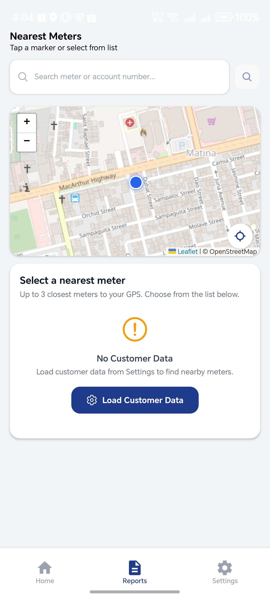

# Leak Alert Mobile QA Test Result — July 31, 2026

## Test summary

| Field | Result |
| --- | --- |
| Application | DCWD Leak Alert native Android app |
| Package | `com.davaowater.leakreport` |
| Environment | Development |
| Automation | Maestro |
| Test flow | `flows/mobile/leak-alert/02-mobile-leak-alert-e2e.yaml` |
| Final run | `audit-results/mobile-leak-alert-02-native-edge-run/2026-07-31_160351` |
| Automated commands | 29 completed, 0 failed |
| Overall result | **Passed with two visual/usability observations requiring confirmation** |

The stabilized native run successfully:

1. Cleared the application's local state and launched the app.
2. Entered valid credentials and signed in.
3. Verified the authenticated greeting and dashboard counters.
4. Verified the Submitted, Synced, Pending, and Drafts labels.
5. Verified the Home, Reports, and Settings navigation items on Home.
6. Opened Reports and captured the resulting Nearest Meters screen.

Earlier launch and selector failures were not classified as application defects
because the stabilized final run completed the same path successfully.

## Evidence

The authenticated Home screenshot is intentionally not published because this
is a public repository and the raw artifact displays the tester's full name.
The Maestro command artifact confirms that Home, Reports, and Settings were all
visible and asserted successfully before Reports was selected.

## Observation MOB-UI-001: Settings navigation is absent on Reports

**Classification:** Possible navigation defect  
**Severity:** Medium  
**Status:** Needs confirmation on another supported Android device

### Preconditions

- The Leak Alert Android application is installed.
- The tester has a valid account.
- Location access is available or has already been granted.

### Steps to reproduce

1. Clear the Leak Alert application's state.
2. Launch the application.
3. Enter a valid username and password.
4. Tap **LOGIN**.
5. Wait for the authenticated Home screen.
6. Confirm that **Home**, **Reports**, and **Settings** are visible in the
   bottom navigation.
7. Tap **Reports**.
8. Wait until screen animation is complete.
9. Inspect the bottom navigation.

### Expected result

The bottom navigation remains consistent and displays **Home**, **Reports**,
and **Settings**, allowing the user to move directly to Settings.

### Actual result

The captured Reports screen displays **Home** and **Reports**, but no visible
**Settings** item. This is especially problematic because the same screen tells
the user to load customer data from Settings.

### User impact

A user with no loaded customer data may be told to open Settings but may not
have a visible Settings navigation control from the current screen.

### Evidence

See the screenshot above. The final automated run first passed assertions for
all three navigation items on Home, then selected Reports and captured this
screen after animations completed.

## Observation MOB-A11Y-001: Status-bar icons have insufficient contrast

**Classification:** Possible accessibility/visual defect  
**Severity:** Low  
**Status:** Needs confirmation across supported Android themes and devices

### Steps to reproduce

1. Launch Leak Alert using the light application theme.
2. Sign in with a valid account.
3. Open **Reports**.
4. Inspect the Android status bar at the top of the screen.

### Expected result

The time, network, battery, and notification icons use a color with sufficient
contrast against the application background and remain clearly readable.

### Actual result

The status-bar icons are white or extremely light against a light gray/white
background, making them difficult to read.

### User impact

Users with low vision or users operating the device in bright conditions may
not be able to read system status information.

### Evidence

The low-contrast system icons are visible at the top of the Reports screenshot.

## Coverage limitation

This run stops after opening Reports. It does not yet validate:

- customer-data loading and meter search;
- report creation and submission;
- GPS denial, unavailable GPS, or inaccurate-location handling;
- taking and uploading evidence photos;
- draft persistence and offline synchronization;
- duplicate-report prevention;
- session persistence, Settings behavior, or logout;
- behavior across screen sizes, Android versions, font scaling, or dark mode.

The two observations above should therefore be treated as focused findings, not
as a complete certification of the mobile application.

## Recommended follow-up

1. Repeat MOB-UI-001 on at least one physical Android device and one additional
   resolution.
2. Confirm whether Settings is intentionally hidden during the report journey.
3. Measure status-bar contrast against WCAG guidance and verify light/dark
   system-bar configuration.
4. Extend the Maestro native flow through customer-data loading, report
   submission, draft/offline recovery, and logout.
